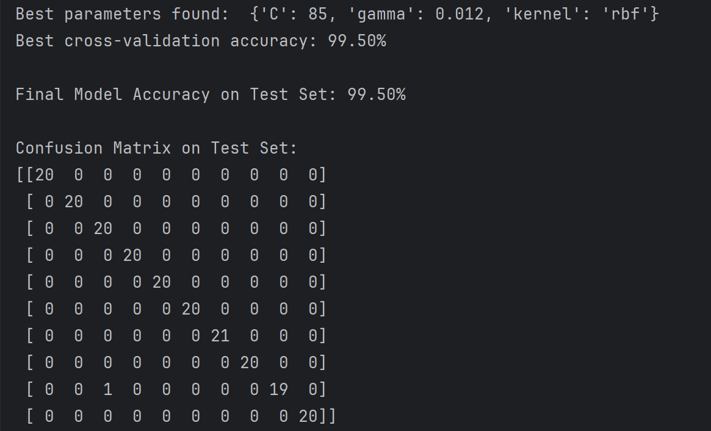

# 实时手势识别系统 (基于 MediaPipe 和 SVM)

本项目利用 Google 的 MediaPipe 框架进行高性能的手部关键点检测，通过自定义的特征工程，并结合经典的机器学习分类器——支持向量机（SVM），构建了一个无需 GPU、在普通 CPU 上即可流畅运行的实时手势识别系统。

该系统能够识别用户自定义的多种手势（本项目示例为10种），并实时在摄像头画面中标注出预测结果和置信度。

## 效果预览



## 主要特性

- **实时性**: 在普通CPU上实现低延迟的手势识别。
- **高精度**: 通过 MediaPipe 精准捕捉21个手部关键点，并使用SVM进行有效分类。
- **无需GPU**: 算法核心依赖CPU，硬件门槛低。
- **高度可定制**: 可轻松扩展以识别更多、更复杂的手势。
- **模块化代码**: 项目代码分为数据采集、特征提取、模型训练和实时预测四个独立的脚本，逻辑清晰。

## 技术栈

- **Python 3.x**
- **OpenCV**: 用于图像处理和摄像头视频流读取。
- **MediaPipe**: 用于高效的手部关键点检测。
- **Scikit-learn**: 用于实现和训练支持向量机 (SVM) 模型。
- **NumPy**: 用于高性能的科学计算和特征向量处理。
- **Joblib**: 用于模型的保存和加载。

## 项目结构

```
.
├── data/                  # 存放采集的手势图片
│   ├── 0/
│   ├── 1/
│   └── ...                # 对应10个手势类别的文件夹
├── demo/                  # 存放效果及演示
│   ├── ...gif
│   ├── ...mp4
│   └── ...                
├── gesture-webapp/        # 存放采集的手势图片
│   ├── backend/
│   │       ├── scaler.pkl  # 训练好的SVM模型文件
│   │       ├── svm_gesture_model_tuned.pkl  # 训练好的SVM模型文件
│   │       ├── main-3.py  # 服务器主程序
│   │       ├── main-*.py
│   │       └── ...  # 服务器迭代主程序
│   ├── frontend/
│   │       ├── index-2_3.html  # 网页文件
│   │       ├── index-**.html
│   │       └── ...  # 网页文件迭代
│   ├── 技术实现  # 一些废话
│   └── 玩法  # 希望实现的玩法
├── scaler.pkl  # 训练好的SVM模型文件
├── svm_gesture_model_tuned.pkl  # 训练好的SVM模型文件
├── gesture_features.csv   # 从图片中提取的特征数据集
├── collect_data.py        # 步骤1: 运行此脚本采集手势图片
├── create_dataset.py      # 步骤2: 运行此脚本从图片中提取特征并生成CSV文件
├── train_svm_tuned.py           # 步骤3: 运行此脚本训练SVM模型
├── realtime_predict_tuned.py    # 步骤4: 运行此脚本进行实时手势识别
└── README.md                    # 本说明文档
```

## 安装与配置

1.  **克隆项目仓库**
    ```bash
    git clone https://github.com/GZC-Jr/SVM-gesture-webapp.git
    cd SVM-gesture-webapp
    ```

2.  **安装所需依赖**
    ```bash
    pip install opencv-python mediapipe scikit-learn numpy joblib
    ```

## 使用流程

请严格按照以下四个步骤操作，以完成从数据采集到实时识别的全过程。

***特别强调：  
如果需要复现前端应用，只需将训练好的模型替换掉gesture-webapp中的模型   
启动main.py服务器，点击进入网页即可***

### 步骤 1: 数据采集

此步骤为你的10种手势分别拍摄图片。

1.  打开 `collect_data.py` 文件。
2.  修改 `label` 变量为你想要采集的手势编号（例如，从 `"0"` 开始）。
3.  运行脚本：
    ```bash
    python collect_data.py
    ```
4.  在弹出的摄像头窗口中，摆好对应手势，然后按 `s` 键保存当前帧。为每个手势采集几百张图片（建议200-500张），以保证模型鲁棒性。
5.  按 `q` 键退出。
6.  重复以上步骤，直到所有10种手势的数据都采集完毕。数据会自动保存在 `data/` 目录下对应的子文件夹中。

### 步骤 2: 特征提取

此步骤会将所有采集到的图片转换成SVM能够理解的数字特征。

- 直接运行脚本：
  ```bash
  python create_dataset.py
  ```
- 脚本会遍历 `data/` 文件夹下的所有图片，提取手部关键点坐标作为特征，并最终生成一个 `gesture_features.csv` 文件。

### 步骤 3: 训练模型

此步骤使用上一步生成的特征数据来训练SVM分类器。

- 直接运行脚本：
  ```bash
  python train_svm.py
  ```
- 脚本会自动加载 `gesture_features.csv`，划分训练集和测试集，训练SVM模型，并在控制台打印出模型的准确率。
- 训练完成后，一个名为 `svm_gesture_model_tuned.pkl` 和 `scaler.pkl` 的模型文件将被保存在项目根目录。

### 步骤 4: 实时识别

万事俱备！现在可以启动实时识别系统了。

- 确保 `svm_gesture_model_tuned.pkl` 和 `scaler.pkl` 文件存在。
- 运行脚本：
  ```bash
  python realtime_predict.py
  ```
- 系统将打开摄像头，实时检测你的手势，并在屏幕左上角显示识别出的手势类别和置信度。
- 按 `q` 键退出程序。

## 工作原理

1.  **手部关键点检测**: 使用 **MediaPipe Hands** 模型，它可以从单张图像中精准定位出手部的21个关键点（包括手腕、指关节等）的3D坐标。
2.  **特征工程**: 为了让模型不受手在画面中的位置、大小和旋转的影响，我们进行了**归一化处理**。具体做法是：
    -   以手腕（第0号关键点）作为坐标系的原点。
    -   计算其余20个关键点相对于手腕的坐标。
    -   将这20个点的相对坐标 (x, y) 展平成一个40维的向量。这个向量就是代表该手势的“特征”。
3.  **SVM 分类**: **支持向量机 (SVM)** 是一种强大的监督学习分类器。我们用上一步提取的特征向量和对应手势的标签来训练SVM。SVM的目标是学习到一个决策边界，能够最好地区分不同手势的特征向量。训练完成后，模型就能根据新的手势特征来预测其类别。

4. **模型参数调优**: 使用 `GridSearchCV` 等工具半自动寻找SVM的最佳超参数（如 `C` 和 `gamma`），以进一步提升准确率。

## 未来的改进方向

- [1] **优化特征工程**: 除了相对坐标，还可以加入手指关节角度、指尖距离等更丰富的几何特征。
- [2] **增加手势种类**: 按照现有流程，可以方便地采集并添加更多手势。
- [3] **构建图形用户界面 (GUI)**: 使用 PyQt 或 Tkinter 为应用创建一个更友好的用户界面。

## 许可证

本项目采用 [MIT 许可证](LICENSE)。
